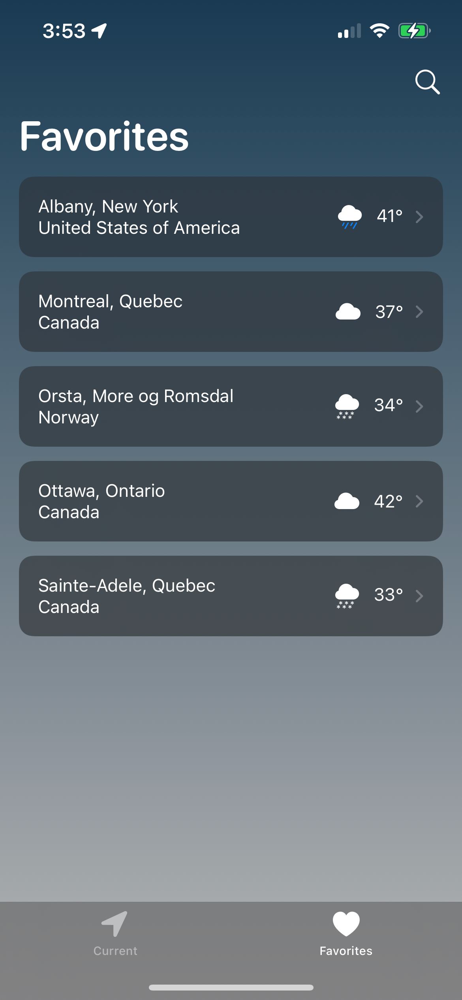
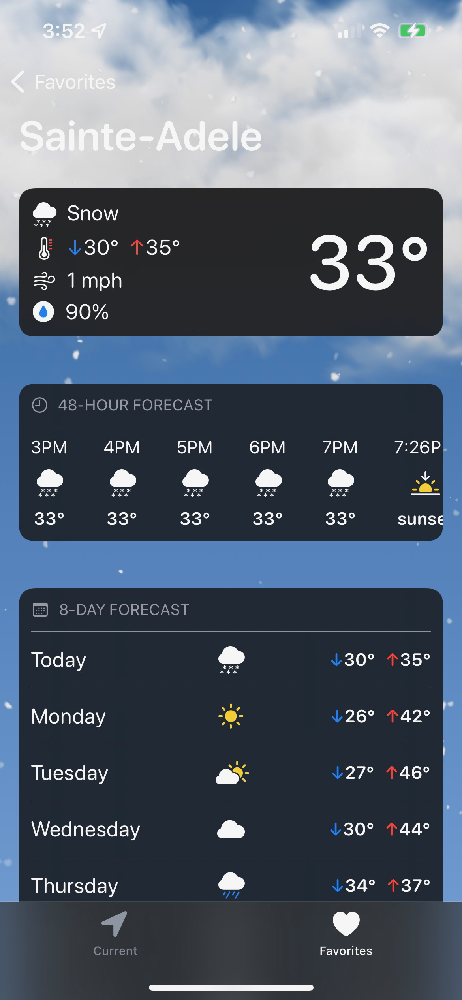
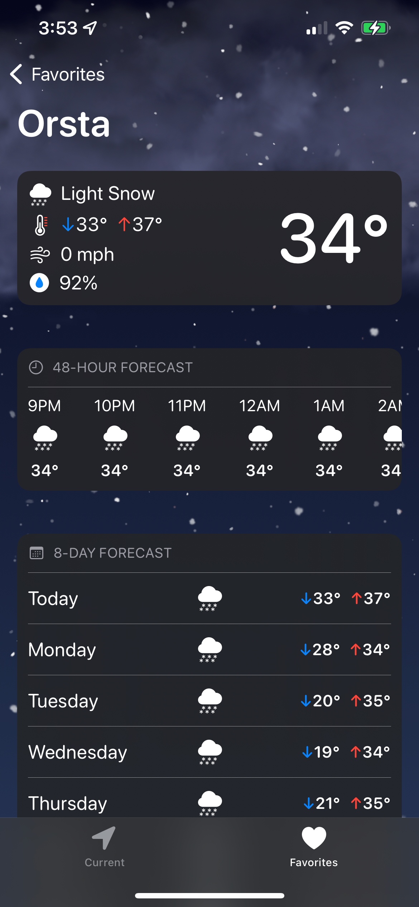
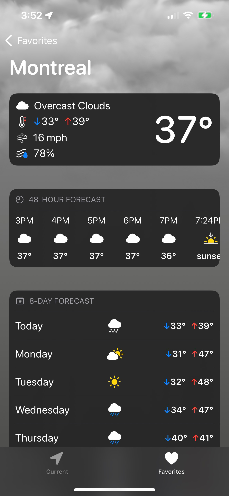
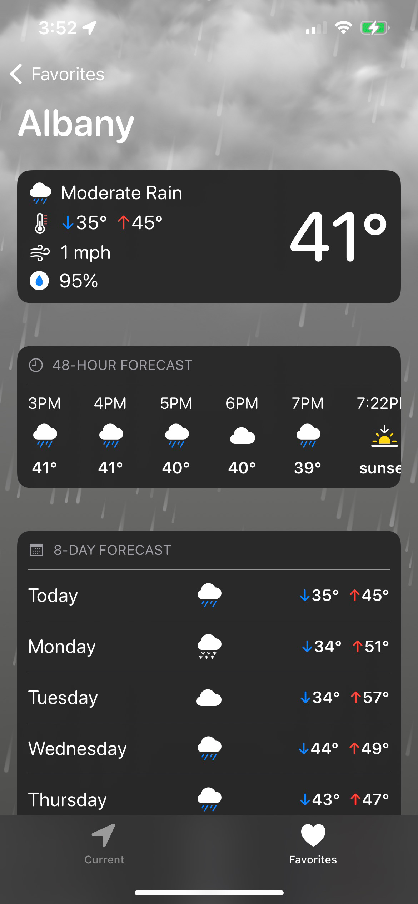

# SwiftWeather


SwiftWeather is a weather app built with SwiftUI that uses [Open Weather's](https://openweathermap.org) API. User's can view the weather for their current location and search for other location's weather using [Weather API's](https://www.weatherapi.com/api-explorer.aspx#search) location search API. Wether data is persisted through the use of CoreData, therefore new weather is only fetched when necessary.


## Features
- Weather for current location
- Weather for favorited locations
- Search for specific locations and add them to favorited list
- Current Forecast with in-depth details
- 48-Hour Forecast
- 8-Day Forecast
- Custom dynamic UI based on weather conditions and time of day
- 100% dynamic text size support
- Adaptive color schemes based on user's light/dark mode 

## Technologies
- SwiftUI
- MVVM
- CoreData
- Asynchronous Network Fetching
    - Async/Await
- Parse JSON API Data
- CoreLocation
- Combine

## Requirements
- Xcode 13.0+
- iOS 15.0+
- OpenWeather API Key

- Replace `weatherAPIKey` and `locationAPIKey` with your API Keys 

```swift
extension APIManager.APIEndPoint {
   private static let weatherAPIKey = APIKeys.weatherAPIKey
   private static let locationAPIKey = APIKeys.locationAPIKey
}
```

# Demo

Light Mode                                                         |  Dark Mode                                                       
:----------------------------------------------------------------:|:--------------------------------------------------------------------:
[](image.png) | [](image.png)

Search For Location                                                    |  Favorites Weather
:---------------------------------------------------------------------:|:--------------------------------------------------------------------:
[](image.png) | [](image.png)

Snowy Day                                                              |  Snowy Night
:----------------------------------------------------------------------:|:--------------------------------------------------------------------:
[](image.png) | [](image.png)

Cloudy                                                                 |  Rainy
:---------------------------------------------------------------------:|:--------------------------------------------------------------------:
[](image.png) | [](image.png)


## Background of App Development
The reason why I created this app was mostly for educational purposes, to improve my app architecture, core data, swiftUI design, and networking skills. 

Originally this app had no persistent storage method. While testing, I thought it was unnecessary to fetch the weather every-time the app opened; for example if the user opens, closes then opens again it would be a waste of resources to fetch new data. The creation and updating methods of weather managed objects are done on a background thread using a background context. Although this may not be necessary, because the data is UI/User related, I wanted to practice since I had previously never used background contexts. This paid off because I learned a-lot on the way such as how to reference objects in different contexts.

This app uses the new async/await features in swift in place of escaping completion handlers. 

There are several attributes that are present in the core data model and the weather domain model that are not used. This is purposeful and they are left there for future use.

The UI design is based off Apple's own weather app and the dynamic background is a modified version of a [Hacking With Swift](https://www.hackingwithswift.com) project. 


